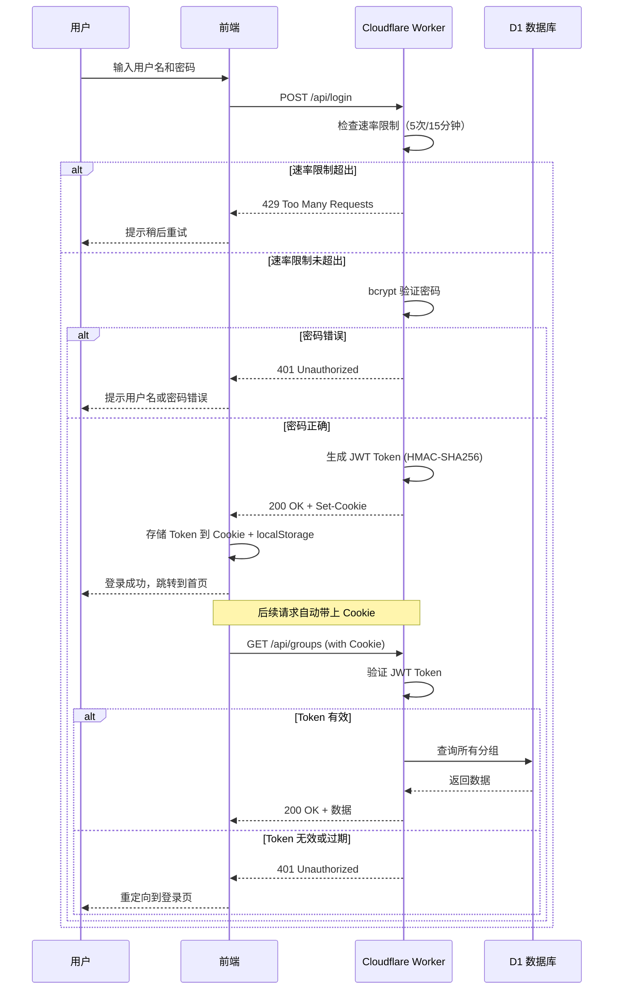

# 认证 API

NaviHive 使用 JWT (JSON Web Token) 进行身份认证，结合 bcrypt 密码哈希和 HttpOnly Cookie 存储，提供安全可靠的认证机制。

## 登录

`POST /api/login`

用户登录并获取 JWT Token。

### 请求

```http
POST /api/login
Content-Type: application/json

{
  "username": "admin",
  "password": "your-password",
  "rememberMe": true
}
```

### 参数

| 参数 | 类型 | 必填 | 说明 |
|------|------|------|------|
| `username` | string | ✅ | 用户名 |
| `password` | string | ✅ | 密码（明文） |
| `rememberMe` | boolean | ❌ | 是否记住登录<br>默认：`false`（7天）<br>`true`：30天 |

### 响应

#### 成功 (200)

```json
{
  "token": "eyJhbGciOiJIUzI1NiIsInR5cCI6IkpXVCJ9...",
  "expiresIn": 604800
}
```

Token 会自动存储在 HttpOnly Cookie 中：

```
Set-Cookie: authToken=eyJhbGci...; HttpOnly; Secure; SameSite=Lax; Max-Age=604800
```

**返回字段说明**：

| 字段 | 类型 | 说明 |
|------|------|------|
| `token` | string | JWT Token（也会存入 Cookie） |
| `expiresIn` | number | Token 有效期（秒）<br>- 标准：604800（7天）<br>- 记住我：2592000（30天） |

#### 失败 (401)

```json
{
  "error": "用户名或密码错误"
}
```

#### 速率限制 (429)

当同一 IP 在 15 分钟内尝试登录超过 5 次时：

```json
{
  "error": "登录尝试次数过多，请稍后再试"
}
```

### 示例代码

::: code-group

```javascript [Fetch API]
const response = await fetch('https://your-app.workers.dev/api/login', {
  method: 'POST',
  headers: {
    'Content-Type': 'application/json',
  },
  body: JSON.stringify({
    username: 'admin',
    password: 'your-password',
    rememberMe: true,
  }),
  credentials: 'include', // 重要：包含 Cookie
});

if (response.ok) {
  const data = await response.json();
  console.log('登录成功，Token 有效期:', data.expiresIn, '秒');
  // Token 已自动存储在 Cookie 中
} else if (response.status === 429) {
  console.error('登录次数过多，请 15 分钟后重试');
} else {
  const error = await response.json();
  console.error('登录失败:', error.error);
}
```

```typescript [TypeScript Client]
import { NavigationClient } from './API/client';

const client = new NavigationClient('https://your-app.workers.dev');

try {
  await client.login('admin', 'your-password', true);
  console.log('登录成功');
} catch (error) {
  console.error('登录失败:', error.message);
}
```

```bash [cURL]
curl -X POST https://your-app.workers.dev/api/login \
  -H "Content-Type: application/json" \
  -d '{
    "username": "admin",
    "password": "your-password",
    "rememberMe": true
  }' \
  -c cookies.txt  # 保存 Cookie 到文件
```

:::

---

## 验证状态

`GET /api/auth/status`

检查当前用户的认证状态。

### 请求

```http
GET /api/auth/status
Cookie: authToken=eyJhbGciOiJIUzI1NiIs...
```

::: tip 自动发送 Cookie
如果你使用 `credentials: 'include'`，浏览器会自动发送 Cookie，无需手动设置。
:::

### 响应

#### 已认证 (200)

```json
{
  "authenticated": true
}
```

#### 未认证 (200)

```json
{
  "authenticated": false
}
```

::: warning 注意
即使未认证，该接口也返回 `200` 状态码，只是 `authenticated` 字段为 `false`。
:::

### 示例代码

::: code-group

```javascript [Fetch API]
const response = await fetch('https://your-app.workers.dev/api/auth/status', {
  credentials: 'include',
});

const data = await response.json();

if (data.authenticated) {
  console.log('用户已登录');
} else {
  console.log('用户未登录');
  // 重定向到登录页
  window.location.href = '/login';
}
```

```typescript [TypeScript Client]
import { NavigationClient } from './API/client';

const client = new NavigationClient('https://your-app.workers.dev');

const isAuthenticated = await client.checkAuthStatus();

if (!isAuthenticated) {
  console.log('需要登录');
  // 重定向到登录页
}
```

:::

---

## 登出

目前 NaviHive 没有单独的登出 API。要登出，只需：

### 方式一：清除 Cookie（推荐）

```javascript
// 清除 authToken Cookie
document.cookie = 'authToken=; Max-Age=0; path=/';

// 重定向到首页
window.location.href = '/';
```

### 方式二：清除 localStorage（备用）

```javascript
// 清除 localStorage 中的 token（如果有）
localStorage.removeItem('authToken');

// 清除 Cookie
document.cookie = 'authToken=; Max-Age=0; path=/';

// 重定向到首页
window.location.href = '/';
```

---

## 认证流程

### 完整认证流程图



### Token 验证流程

所有需要认证的 API 请求都会经过以下验证流程：

1. **提取 Token**
   - 优先从 Cookie (`authToken`) 中读取
   - 备用：从 `Authorization` Header 中读取

2. **验证 Token**
   - 使用 Web Crypto API 验证签名（HMAC-SHA256）
   - 检查 Token 是否过期

3. **权限判断**
   - 如果 Token 有效：允许访问所有内容（包括私密内容）
   - 如果 Token 无效/不存在：
     - 访客模式下：只能访问 `is_public=1` 的内容
     - 非访客模式下：拒绝访问

---

## 安全特性

### 1. 密码加密

- 使用 **bcrypt** 哈希算法（10 轮 salt）
- 密码以哈希形式存储在环境变量中
- 登录时使用 bcrypt 验证明文密码

### 2. Token 安全

- 使用 **Web Crypto API** 的 HMAC-SHA256 算法签名
- Token 包含过期时间，自动失效
- Token 存储在 **HttpOnly Cookie** 中，防止 XSS 攻击

### 3. Cookie 安全属性

```
Set-Cookie: authToken=<token>;
  HttpOnly;           // 防止 JavaScript 访问
  Secure;             // 仅 HTTPS 传输
  SameSite=Lax;       // 防止 CSRF 攻击
  Max-Age=604800      // 7 天过期
```

### 4. 速率限制

- **限制规则**：5 次/15 分钟/IP
- **实现方式**：基于内存的 `SimpleRateLimiter`
- **防护目标**：暴力破解攻击

---

## 常见问题

### 1. Token 存储在哪里？

**主要存储**：HttpOnly Cookie (`authToken`)
**备用存储**：localStorage (`authToken`)

::: tip 为什么有两种存储方式？
- HttpOnly Cookie 更安全（防 XSS），是主要方式
- localStorage 作为备用，兼容某些特殊场景
:::

### 2. Token 过期后会怎样？

- 访问需要认证的 API 会返回 `401 Unauthorized`
- 前端应该检测到 401 后，重定向到登录页
- 用户需要重新登录获取新 Token

### 3. 如何修改 Token 有效期？

Token 有效期在 `worker/index.ts` 中定义：

```typescript
const expiresIn = rememberMe ? 30 * 24 * 60 * 60 : 7 * 24 * 60 * 60;
// 记住我：30天 | 标准：7天
```

你可以修改这些值并重新部署。

### 4. 如何修改登录密码？

```bash
# 1. 生成新密码的哈希
pnpm hash-password newPassword

# 2. 复制输出的哈希值

# 3. 更新 wrangler.jsonc 中的 AUTH_PASSWORD
{
  "vars": {
    "AUTH_PASSWORD": "$2a$10$新的哈希值..."
  }
}

# 4. 重新部署
pnpm deploy
```

### 5. 登录速率限制如何重置？

速率限制基于内存实现，会在以下情况自动重置：

- 15 分钟后自动清除
- Worker 重启时清除
- 部署新版本时清除

---

## 下一步

- [分组 API](./groups) - 管理导航分组
- [站点 API](./sites) - 管理网站链接
- [安全最佳实践](/security/best-practices) - 提升安全性
